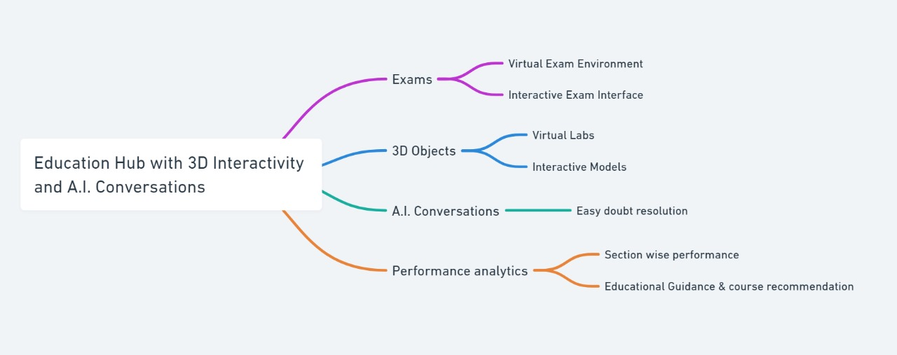
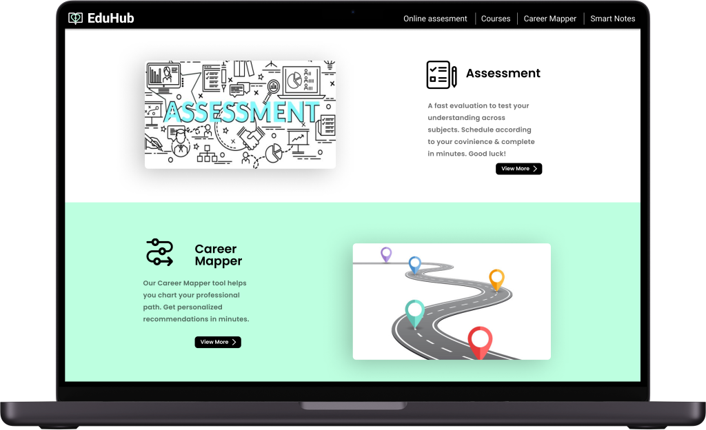
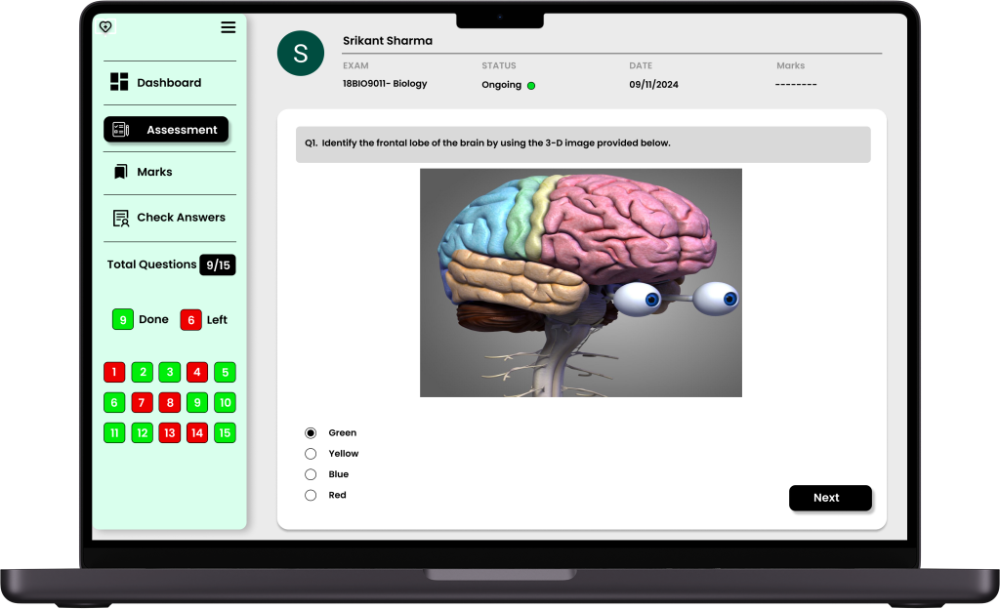
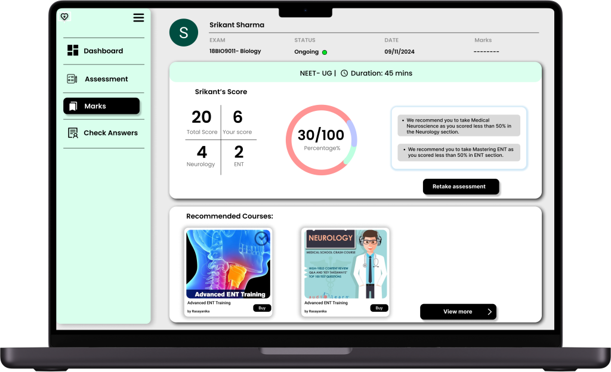

# EduHub :pushpin:
## Problem Statement :
Design a future of learning in India, leveraging Industry 4.0, to empower students for competitive and higher education entrance exams. Consider AI, real-time data, and interactive experiences to personalize learning journeys and maximize success rates. How can technology bridge the gap between traditional education and the needs of tomorrow's workforce?

## Solution Overview :memo:
* One-stop solution for all your educational needs.
* 3D models for a more practical and captivating educational experience.
* Presence of an on-screen AI assistant to clear doubts instantly.
* Performance analysis of tests.
* Course recommendation according to performance in tests.

## Architecture :hammer_and_wrench:

##  Flow Diagram:

## UI Mockups :computer:
### Home Page :
  

### Assessment Page :
  

### Performance Analysis :
  

### Course Page :
  

## 3D Objects used :
* <a href="https://sketchfab.com/models/24ec03412dd8432bb0d3e750a72608e0/embed">Sections of Brain</a>
* <a href="https://sketchfab.com/models/ad7d7e16b98f421db0cda79f265fcc8d/embed">Anatomy of Airway</a>

## Tech Stack :
    

## APIs used :
* <a href="https://ai.google.dev/">Gemini API</a>

## Future scope 📈
* Multi-lingual support for a more diverse user base.
* Chatroom for students preparing for the same test to promote peer-learning.
* Providing discounts on courses based on previous test performances.
* Ability to book sessions with our in-house career counsellor

## FAQs :question:

  
What is EduHub?
 
  <blockquote>Eduhub is a comprehensive web application designed to revolutionize the educational experience. Offering a one-stop solution, Eduhub provides 3D models for immersive learning, an on-screen AI assistant for instant doubt resolution, and detailed performance analysis of tests. It goes beyond by recommending courses based on individual test performance making it a holistic platform for all your educational needs.</blockquote>

  
What is our vision and mission?
 
  <blockquote>Education is of paramount importance in today's society. It is what liberates us and help us advance as a race. This project will help us provide quality education to students of all demographics, irrespective of their location or availability of resources. It also aims to provide students with a much deeper and fundamental understanding of concepts with the help of detailed 3d models.</blockquote>

  
Why should you choose EduHub over other online learning platforms?
 
  <blockquote>With the current advancements in technology, we have a lot of revolutionary tools at our disposal. EduHub leverages these tools to provide its users with interactive study material, comprehensive test analysis and AI doubt assistance.</blockquote>

  
How does the on-screen AI assistant work, and what types of questions can it help with?
 
  <blockquote>Our on-screen AI assistant (K.A.I) raises the bar for doubt-resolution. Whenever you have a doubt regarding the course material, you can instantly proceed to resolve it with the help of K.A.I. It is equipped to handle any and all of your doubts with ease. </blockquote>

  
How does this project bridge the gap between traditional education and the needs of tomorrow's workforce?
 
  <blockquote>In the current demographic where people are easily bored and seek engaging and interactive experiences, platforms like EduHub play a crucial role by offering innovative solutions that capture and sustain users' interest. While, traditional education takes help of 2d diagrams to explain concepts, the existence of 3d models provides a much deeper understanding of the same concepts. Essentially, EduHub aims to remove the shackles of traditional education, which existed due to past limitations.</blockquote>

